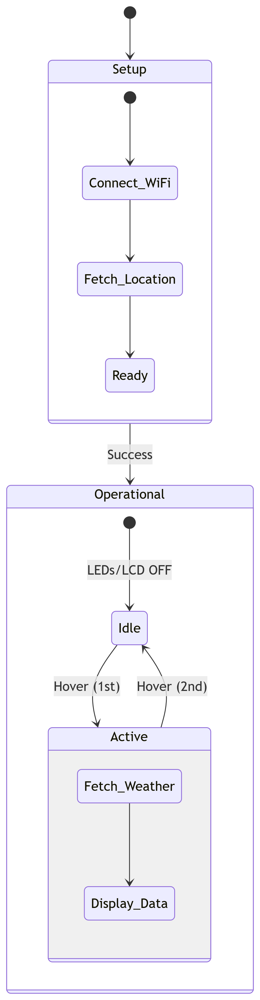

## Description 📚
A decorative gadget that activates with a hand hover, changing color according to the outside temperature and displaying live weather data

Built during: Principles of Digital Fabrication (Spring 2025)

## Features
- Automatic Locatin Detection 🌍 - Fetches location via IP
- Real-Time Weather Data ☁️ – Retrieves and displays current weather conditions
- Proximity Activation ✋ – Detects hand hover to activate the ball
- Temperature-Responsive LED Pattern 🌈 – Ball changes color based on outside temperature
- Live Weather Display 📺 – Location and key weather stats shown on an LCD screen
  
## Components 🛠️
- Raspberry Pi Pico WH
- Ultrasonic Sensor to detect hovering motion
- LCD Screen for displaying weather info
- USB-C Port for powering the circuit
- LED Strip for making the ball glow
- 3D printed translucent ball to disperse the light
- Plywood stand to hold the circuit

## Circuit Diagram ⚡
...

## Code Architecture🧩

## Libraries & Modules 📂
- LcdApi & I2cLcd - LCD control ([Source](https://github.com/T-622/RPI-PICO-I2C-LCD))
- Network & Urequests - API Requests & WiFi Connection
- Neopixel - LED Strip Control
- Machine & Utime - GPIO & Timing

## Potential Improvements 🚀 
- Implementing async functionality for smoother workflow
- Expanding LED Strip patterns to cover more weather stats
- Utilizing more advanced display to show more data

## Team 👥
- Caleb Bassalygo, Embedded Engineer & Project Manager
- Aura-Lyydia Huttu, 2D Designer & Documentation Specialist
- Jere Uusimäki, 3D Designer & Financial Controller
- Kalle Uitto, Generalist
